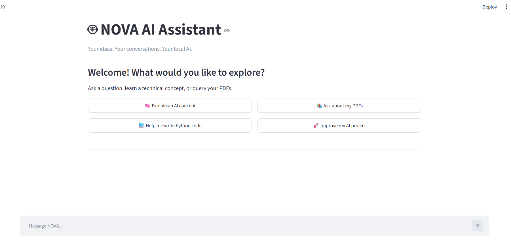
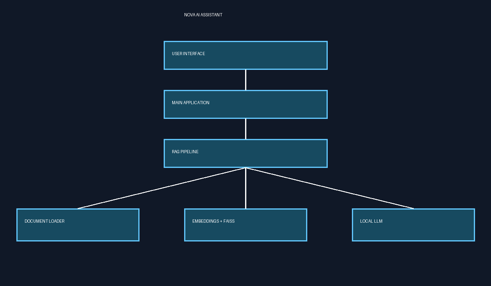

# NOVA AI Assistant

**A local-first Retrieval-Augmented Generation (RAG) application for asking questions about PDF documents using semantic search and a locally running language model.**

[](https://github.com/manojreddy2997/nova-ai-assistant/actions/workflows/tests.yml)
[](https://www.python.org/)
[](https://streamlit.io/)
[](LICENSE)

NOVA helps users explore their own PDF documents through natural-language questions. It extracts and chunks document text, generates embeddings, retrieves relevant passages with ChromaDB, and passes the retrieved context to an Ollama language model to generate source-aware responses.

The project demonstrates an end-to-end RAG workflow, local model integration, retrieval evaluation, and automated testing.

## Application Preview



## Architecture



## Key Features

- **PDF ingestion:** Extract text and preserve page-level metadata.
- **Text chunking:** Split documents into smaller passages for retrieval.
- **Semantic search:** Find relevant passages using Sentence Transformers embeddings.
- **Vector storage:** Persist searchable document embeddings and metadata in ChromaDB.
- **Local LLM inference:** Generate responses with Ollama and the configured `llama3.2:3b` model.
- **Source-aware answers:** Include retrieved document references and page information where available.
- **Relevance filtering:** Exclude retrieved chunks that exceed the configured distance threshold.
- **Retrieval evaluation:** Measure source retrieval on a small set of known-answer and unrelated questions.
- **Automated testing:** Run unit tests with Pytest and GitHub Actions.

## How It Works

1. **Ingest:** Read PDF documents and extract their text.
2. **Chunk:** Split extracted text into manageable passages while retaining relevant metadata.
3. **Embed:** Convert passages into vector embeddings using Sentence Transformers.
4. **Index:** Store passages, embeddings, and metadata in ChromaDB.
5. **Retrieve:** Embed the user's question and search for semantically relevant passages.
6. **Generate:** Pass the question and retrieved context to the local Ollama model.
7. **Respond:** Return an answer grounded in retrieved context, with source information where available.

## Technology Stack

| Technology | Purpose |
|---|---|
| Python | Application logic and integration |
| Streamlit | Chat user interface |
| Sentence Transformers | Text and query embeddings |
| ChromaDB | Persistent vector storage and similarity search |
| Ollama | Local language-model inference |
| PyPDF | PDF text extraction |
| Pytest | Automated testing |
| GitHub Actions | Continuous integration |

## Project Structure

```text
nova-ai-assistant/
├── .github/
│   └── workflows/
│       └── tests.yml
├── app/
│   ├── backend/
│   │   ├── document_processor.py
│   │   ├── embeddings.py
│   │   ├── llm.py
│   │   └── vector_store.py
│   └── frontend/
│       └── chat_ui.py
├── assets/
│   ├── nova-architecture.png
│   └── nova-chat-interface.png
├── data/
│   ├── documents/
│   └── chroma_db/
├── tests/
├── evaluate_retrieval.py
├── reindex_documents.py
├── requirements.txt
├── pytest.ini
├── .gitignore
├── LICENSE
└── README.md
```

## Getting Started

### Prerequisites

- Python 3.11 recommended
- Git
- [Ollama](https://ollama.com/) installed locally
- Sufficient memory for the configured embedding model and language model

### 1. Clone the repository

```bash
git clone https://github.com/manojreddy2997/nova-ai-assistant.git
cd nova-ai-assistant
```

### 2. Create a virtual environment

**Windows PowerShell**

```powershell
python -m venv .venv
.\.venv\Scripts\Activate.ps1
```

**macOS or Linux**

```bash
python3 -m venv .venv
source .venv/bin/activate
```

### 3. Install dependencies

```bash
python -m pip install -r requirements.txt
```

### 4. Download the language model

```bash
ollama pull llama3.2:3b
```

Ensure Ollama is running and the model name matches the configuration in `app/backend/llm.py`.

The embedding model may be downloaded automatically on first use. Internet access may therefore be required during initial setup.

### 5. Add your PDF documents

Place the PDFs you want to query in:

```text
data/documents/
```

Use documents you have permission to process. Keep private PDFs and the generated vector database out of version control.

### 6. Index the documents

```bash
python reindex_documents.py
```

Run this step again whenever you want to rebuild the index from the PDFs in the documents folder.

### 7. Launch NOVA

```bash
streamlit run app/frontend/chat_ui.py
```

Open the local URL printed in the terminal.

## Testing

Run the automated test suite:

```bash
python -m pytest
```

The repository also includes a retrieval evaluation script:

```bash
python evaluate_retrieval.py
```

The evaluation script checks whether expected document sources appear in the retrieved results and whether an unrelated question returns no results. Its metrics reflect the current evaluation cases; they are not a guarantee of performance on unseen documents or questions.

Tests are also configured to run through GitHub Actions on pushes to `main` and pull requests targeting `main`.

## Privacy and Limitations

- NOVA is designed for local document processing and local LLM inference.
- Initial installation and model downloads may require an internet connection.
- Answer quality depends on document quality, embedding quality, retrieval settings, and the selected language model.
- Scanned PDFs may require an OCR step, which is not guaranteed by the current PDF text-extraction workflow.
- Performance depends on available hardware and memory.
- Source references help users verify responses but do not guarantee that every generated claim is fully supported.
- Review answers against the original documents, particularly for important decisions.

## Potential Future Improvements

- Hybrid keyword and semantic search
- Reranking retrieved passages
- Expanded retrieval benchmarks and regression tests
- More robust citation verification
- Conversation history and document management
- Authentication and access control
- Response latency and resource monitoring

## Skills Demonstrated

- Retrieval-Augmented Generation (RAG)
- PDF ingestion and text processing
- Chunking and metadata preservation
- Embeddings and semantic retrieval
- Vector databases with ChromaDB
- Local LLM integration with Ollama
- Retrieval evaluation and automated testing
- Python application development
- Git, GitHub, and continuous integration

## Author

**Manoj Reddy**

[GitHub Profile](https://github.com/manojreddy2997)